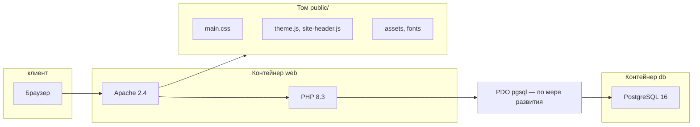

# Архитектура сайта (реализация)

Документ описывает **фактическую структуру кода и инфраструктуры** на текущем этапе. Продуктовые требования и объём MVP по-прежнему задаются [04-functional-spec.md](04-functional-spec.md) и связанными файлами в `docs/`.

## 1. Общая схема

Сайт — **классическое серверное приложение**: запрос приходит на **Apache** в контейнере PHP, ответ формирует **PHP** (HTML), стили и скрипты отдаются как **статика** из каталога веб-корня. База **PostgreSQL** подключена для будущей логики и уже используется для проверки окружения; **Prisma** — только инструмент разработчика для просмотра схемы БД, не часть рантайма страниц.

Интеграция с **Bitrix24** (лиды, каталог из CRM) на уровне архитектуры кода **ещё не внедрена** — предусмотрена ТЗ; появится отдельным слоем (HTTP-клиент, cron, очереди — по проектированию).

## 2. Структура репозитория

| Путь | Назначение |
|------|------------|
| **`public/`** | Веб-корень (в Docker смонтирован в `/var/www/html`). Точка входа `index.php`, статика, доступная по URL. |
| **`public/includes/`** | Общие PHP-фрагменты: шапка, подвал, конфигурация, разметка логотипа. |
| **`public/css/`** | Скомпилированный CSS (`main.css`) — результат сборки SCSS, в репозитории хранится для деплоя без Node. |
| **`public/js/`** | Клиентские скрипты без сборщика (тема, мобильное меню). |
| **`public/assets/brand/`** | Копии бренд-файлов для выдачи в браузер (логотип SVG/PNG); источник макетов — также `assets/brand/` в корне. |
| **`public/fonts/`** | Веб-шрифты (`@font-face`, пути вида `/fonts/...`). |
| **`src/scss/`** | Исходники стилей: `main.scss`, токены, компоненты БЭМ. |
| **`assets/brand/`** | Исходники бренда (SVG, PNG, референсы); при смене логотипа — обновлять и копировать в `public/assets/brand/` при необходимости. |
| **`docs/`** | ТЗ, глоссарий, этот документ. |
| **`prisma/`** | Схема для Prisma Studio / `db pull` — только разработка. |
| **`Dockerfile`**, **`docker-compose.yml`** | Локальный PHP + Apache + PostgreSQL. |

## 3. Поток запроса к странице

1. Пользователь открывает URL (например `/` → `public/index.php`).
2. Скрипт страницы задаёт переменные (`$pageTitle`, `$currentNav` и т.д.), подключает **`includes/header.php`** — выводится `<!DOCTYPE>` … начало `<body>`, шапка.
3. В том же скрипте — разметка **`<main>`** (контент страницы).
4. Подключается **`includes/footer.php`** — подвал, скрипты, закрытие `</body></html>`.

Повторяющиеся данные (меню, телефон, реквизиты) централизованы в **`includes/config.php`** и функции **`site_nav_items()`**.

## 4. PHP: роли файлов

| Файл | Роль |
|------|------|
| **`config.php`** | Константы сайта (телефон, email, адрес, реквизиты), функция меню. |
| **`header.php`** | Каркас `<head>`, ранняя установка `data-theme`, шапка (`site-header`). |
| **`logo-markup.php`** | Встраивание SVG логотипа; опционально классы для шапки/подвала. |
| **`footer.php`** | Подвал (`site-footer`), подключение JS, закрытие документа. |

Именование **БЭМ**: блоки `site-header`, `site-footer`, `page-main`; страницы подключают общие includes без фреймворка.

## 5. Фронтенд

- **Разметка:** HTML5, семантика (`header`, `main`, `footer`, `nav`).
- **Стили:** SCSS → один **`public/css/main.css`**; команда `npm run build:css`, при правках — `npm run watch:css`.
- **Тема:** атрибут **`data-theme="light|dark"`** на `<html>`, токены в **`src/scss/_variables.scss`**, сохранение в `localStorage` (скрипт `theme.js`).
- **Логотип:** встроенный SVG в шапке/подвале; класс **`.st26`** в SVG перекрашивается под светлую тему через CSS (градиенты монограммы не трогаются).
- **JS:** без бандлера, небольшие IIFE-модули.

## 6. Статика и кэширование

- Пути от корня сайта: `/css/main.css`, `/js/...`, `/assets/brand/...`, `/fonts/...`.
- В Docker в контейнер попадает **только** содержимое `public/`, поэтому файлы для браузера должны лежать **внутри `public/`** (копии бренда — в `public/assets/brand/`).

## 7. База данных и Prisma

- **PostgreSQL** в `docker-compose` — целевая БД для приложения (сущности каталога, заявки и т.д. — по мере реализации).
- **`?dbtest=1`** на главной — диагностическое подключение через PDO (только разработка).
- **Prisma** в корне: `DATABASE_URL` в `.env`, `npm run prisma:studio` для просмотра таблиц; **не** используется в PHP-шаблонах.

## 8. Сборка и деплой (ориентир)

- На **REG.RU** веб-корень должен указывать на **`public/`** (или эквивалент: выкладка содержимого `public` в document root).
- Перед выкладкой после изменений SCSS: **`npm run build:css`** и закоммитить обновлённый `public/css/main.css`.
- Зависимости **`node_modules`** на продакшене для отдачи сайта не обязательны, если CSS уже собран.

## 9. Направления развития архитектуры

- Единая точка маршрутизации (front controller или правила Apache) для ЧПУ `/catalog/`, `/about/` и т.д.
- Слой доступа к данным (PDO, репозитории), синхронизация с Bitrix24.
- Формы заявок с CSRF/антиспамом и отправкой в CRM.
- При росте числа страниц — вынос общего каркаса в один «layout»-вход или лёгкий шаблонизатор — по согласованию со стеком.

---

**Версия описания:** 1.0 · **Дата:** 2026-04-19 · Согласовано с текущим деревом проекта.
